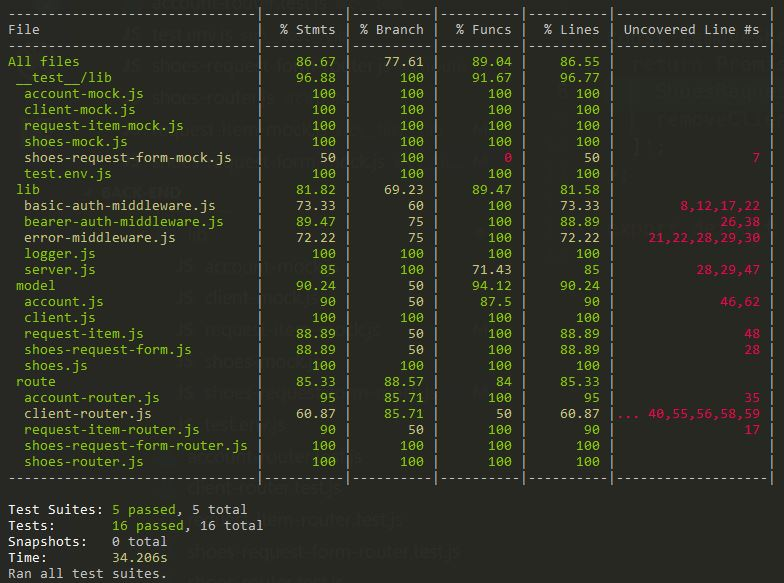
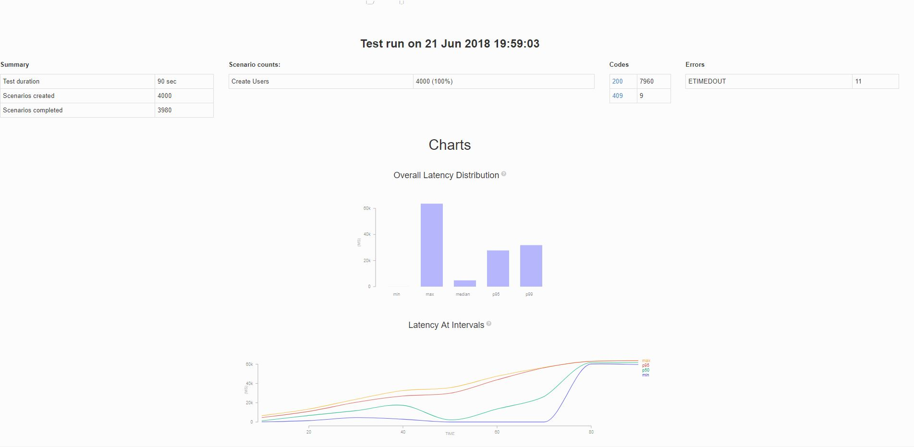

# Redeeming Soles | No Kids Left on the Sidelines

### Index
- [Overview](#overview)
- [Architecture](#architecture)
- [Testing](#testing)
- [Change Log](#change-log)

## Overview
This is a demonstration Back-End for the Redeeming Soles "No kids left on the sideline" project. 
 This backend application utilizes a Mongo data base to track incoming shoe requests from 
 coaches and youth sports leagues for children who need sports shoes but the children's families 
 do not have the ability to obtain the shoes.  In order to best support the tracking of 
 shoes, we implemented an additional schema to account for the inventory of donated shoes to 
 match the request from coaches and sports leagues.

## Architecture
This API recievies and sends calls from the Redeeming Soles frontend.

## Testing
#### Jest testing

#### Artillery.io Load Testing

This application used Jest testing for our TDD approach.  We also Load tested this application 
while it was being hosted on a free Heroku account.
 
## Change Log
- 06-16-2018  11:45PM  Initial Commit
- 06-17-2018  12:05AM  Initial README
- 06-18-2018  08:59AM  Scaffolding for the back-end
- 06-18-2018  09:25AM  2nd Scaffolding Commit
- 06-18-2018  11:04AM  Account, Client, ShoesRequestForm, RequestItem, and Shoes schema's complete.
- 06-18-2018  12:27AM  updated routes
- 06-18-2018  12:31PM  updated package.json & secret
- 06-18-2018  04:30PM  Account POST/GET testing complete.
- 06-18-2018  04:45PM  Client POST/GET testing complete.
- 06-18-2018  05:15PM  Submitting placeholder test for CI.
- 06-18-2018  05:30PM  adding CORS_ORIGINS var.
- 06-19-2018  08:15AM  Update README.md
- 06-19-2018  10:00AM  Request Form POST route + testing complete.
- 06-19-2018  12:00PM  Request Item POST route + testing complete.
- 06-19-2018  01:00PM  adding timeouts to test files to pass CI build.
- 06-19-2018  04:03PM  reconciling front and back end properties
- 06-19-2018  04:10PM  update to gitignore
- 06-20-2018  03:10PM  Order submission working.
- 06-20-2018  12:04PM  request shoes is now working and adding to front end
- 06-20-2018  12:16pm  request shoes is now working
- 06-20-2018  12:55PM  Fixed payload on submit, backend is still not accepting bad request
- 06-20-2018  02:10PM  Updated the Title in webpack.common.js
- 06-20-2018  03:10PM  front-end Order form submission working.
- 06-21-2018  07:44AM  fixed CSS background image
- 06-21-2018  08:06AM  optimized the Background image settings
- 06-21-2018  09:36AM  merging admin functionality.
- 06-21-2018  09:55AM  admin route fix.
- 06-21-2018  10:10AM  login signup styling
- 06-21-2018  11:10AM  request list is populating and scrolling correctly
- 06-21-2018  11:40AM  removing auth-landing lint errors.
- 06-21-2018  11:56AM  squashed sign up 409
- 06-21-2018  12:20AM  ADMIN view works
- 06-21-2018  12:39PM  INPUT SHOES is loading into DB
- 06-21-2018  12:55PM  admin has functionality ~except re-loading dashboard
- 06-21-2018  01:02pm  signin/login form is looking nice
- 06-21-2018  02:38PM  Profile display is properly displaying all data
- 06-21-2018  02:52PM  form datalists are outputing correct values
- 06-21-2018  03:10PM  Auth routing fixed, Request form remove and clear fixed.
- 06-21-2018  03:16PM  fixed profile view to display all fields
- 06-21-2018  03:31PM  Form is sitting nicely in a container now
- 06-21-2018  04:02PM  changed the sites font to match RS brand
- 06-21-2018  04:18PM  added drop menus to the Admin Form, slight adjustments
- 06-21-2018  04:37PM  updated form layout on desktop view
- 06-21-2018  04:45PM  styling adjustments
- 06-21-2018  05:30PM  Request-Item Modal edit view working.
- 06-21-2018  05:47PM  deploy prep
- 06-21-2018  05:50PM  hot fix 
- 06-21-2018  05:53PM  removing shoes actions for GET/REMOVE.
- 06-21-2018  06:16PM  switched all input fields to actual select field
- 06-21-2018  08:27PM  landing page 
- 06-21-2018  08:31PM  landing page
- 06-21-2018  08:43PM  landing pages
- 06-21-2018  08:55PM  Profile Form and landing
- 06-21-2018  09:15PM  added front end testing
- 06-21-2018  09:38PM  modal is wlooking nice and a few other random little bugs
- 06-21-2018  09:44PM  bug styles  
- 06-22-2018  12:05PM  front end testing
- 06-22-2018  01:

## Credits and Collaborations
Thank you to the Code Fellows staff, TA's and fellow 401d23 students!