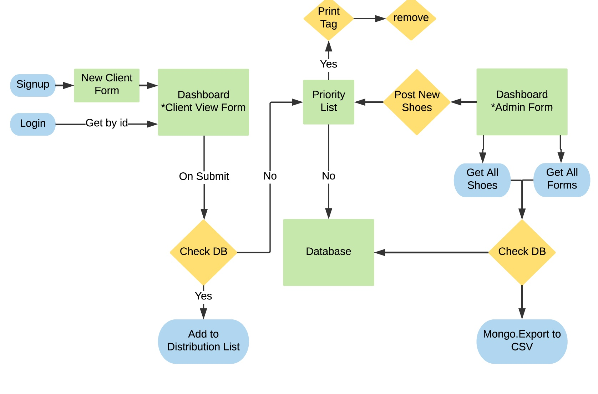

# Redeeming Soles | No Kids Left on the Sidelines

### Index
- [Overview](#overview)
- [Architecture](#architecture)
- [Change Log](#change-log)

## Overview
This is a demonstration Back-End for the Redeeming Soles "No kids left on the sideline" project. 
 This backend application utilizes a Mongo data base to track incoming shoe requests from 
 coaches and youth sports leagues for children who need sports shoes but the children's families 
 do not have the ability to obtain the shoes.  In order to best support the tracking of 
 shoes, we implemented an additional schema to account for the inventory of donated shoes to 
 match the request from coaches and sports leagues.

## Architecture

 
## Change Log
- 06-16-2018  11:45PM  Initial Commit
- 06-17-2018  12:05AM  Initial README
- 06-18-2018  08:59AM  Scaffolding for the back-end
- 06-18-2018  09:25AM  2nd Scaffolding Commit
- 06-18-2018  11:04AM  Account, Client, ShoesRequestForm, RequestItem, and Shoes schema's complete.
- 06-18-2018  12:27AM  updated routes
- 06-18-2018  12:31PM  updated package.json & secret
- 06-18-2018  04:30PM  Account POST/GET testing complete.
- 06-18-2018  04:45PM  Client POST/GET testing complete.
- 06-18-2018  05:15PM  Submitting placeholder test for CI.
- 06-18-2018  05:30PM  adding CORS_ORIGINS var.
- 06-19-2018  08:15AM  Update README.md
- 06-19-2018  10:00AM  Request Form POST route + testing complete.
- 06-19-2018  12:00PM  Request Item POST route + testing complete.
- 06-19-2018  01:00PM  adding timeouts to test files to pass CI build.
- 06-19-2018  04:03PM  reconciling front and back end properties
- 06-19-2018  04:10PM  update to gitignore
- 06-20-2018  03:10PM  Order submission working.
- 06-20-2018  12:04PM  request shoes is now working and adding to front end
- 06-20-2018  12:16pm  request shoes is now working
- 06-20-2018  12:55PM  Fixed payload on submit, backend is still not accepting bad request
- 06-20-2018  02:10PM  Updated the Title in webpack.common.js
- 06-20-2018  03:10PM  front-end Order form submission working.

## Credits and Collaborations
Thank you to the Code Fellows staff, TA's and fellow 401d23 students!